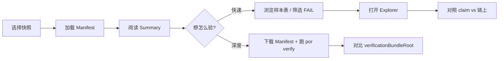
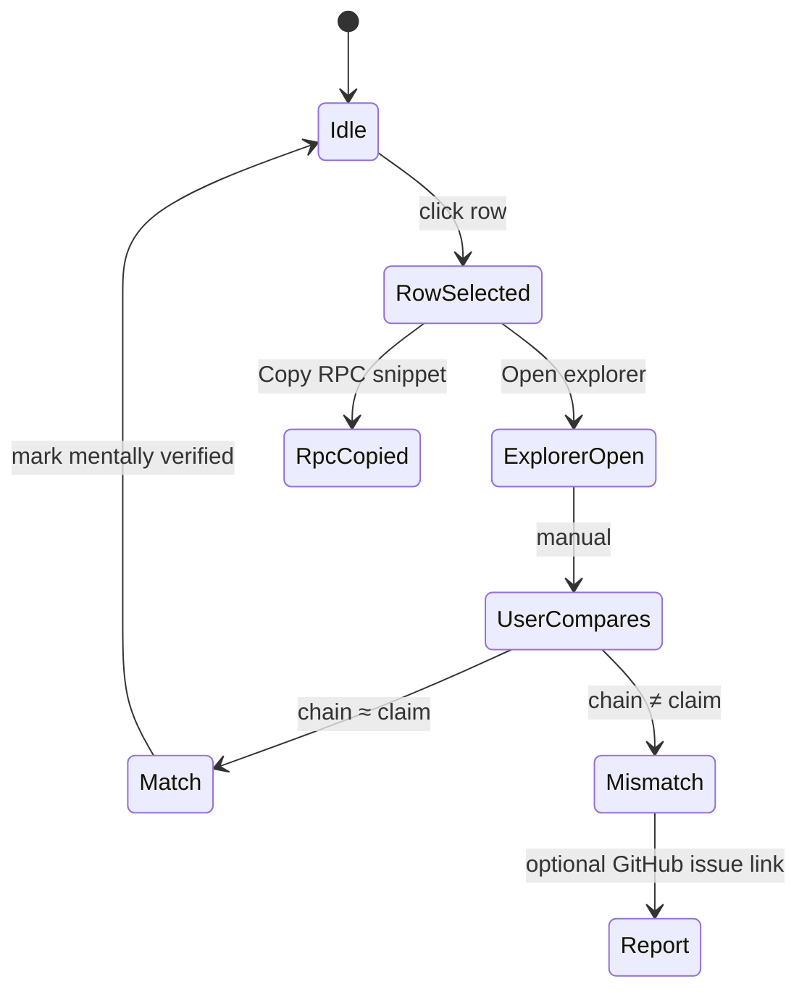

# Deposit 样本清单与用户 Spot-Check 页面

> 让用户在 **不上传任何数据** 的前提下，复现 ardmere 的 Deposit 抽样结论，并对任意一行做 30 秒级的独立抽查。

| 字段 | 值 |
|------|-----|
| 文档版本 | v1.0 |
| Schema | `ardmere/deposit-sample-manifest@1` |
| 页面路径 | `/verify/deposit/` |
| 关联 verifier | `onchain-balance-deposit@1.0` |

---

## 1. 设计目标

| 目标 | 做法 |
|------|------|
| 可复现 | Manifest 绑定 `walletZipSha` + `verificationBundleRoot` + 抽样参数 |
| 轻量验证 | 用户点一行 → 打开区块浏览器 / 复制 RPC 命令 |
| 零上传 | 仅 GET 静态 JSON；可选本地文件选择，数据不出浏览器 |
| 诚实边界 | 标注 `coverage`、链能力（如 Solana 无历史 slot） |

**不做的事**：不在浏览器内跑 200 万行 Deposit；不把用户私有 inclusion zip 混进此页（那是 L3 另一条线）。

---

## 2. 产物与路径

```
artifacts/<exchange>/<auditId>/
  bundles/
    PR01JUN26.verification-bundle.json
  deposit-sample-manifest.json          ← 页面消费的主文件
  deposit-sample-manifest.schema.json   ← 可选，同目录或 /schemas/

verify/deposit/
  index.html                            ← Spot-check 页面（静态）

config/explorer-links.json              ← 各 network 浏览器 URL 模板

fixtures/binance/
  PR01JUN26-deposit-manifest.example.json
```

**发布 URL 示例**（GitHub Pages）：

```
https://ardmere.github.io/verify/deposit/?manifest=/artifacts/binance/PR01JUN26-20260601-period43/deposit-sample-manifest.json
```

---

## 3. 数据格式：`deposit-sample-manifest@1`

### 3.1 顶层结构

```json
{
  "schema": "ardmere/deposit-sample-manifest@1",
  "generatedAt": "2026-06-14T12:00:00Z",
  "generator": "por@deposit-manifest-export@1",

  "snapshot": { ... },
  "artifacts": { ... },
  "sampling": { ... },
  "summary": { ... },
  "networks": { ... },
  "samples": [ ... ]
}
```

### 3.2 字段说明

#### `snapshot`

| 字段 | 类型 | 说明 |
|------|------|------|
| `exchange` | string | `binance` |
| `id` | string | `PR01JUN26` |
| `periodSeq` | int | BAPI period |
| `snapshotTime` | RFC3339 | BAPI 快照时间 |
| `merkleRoot` | hex | 交易所负债树根 |

#### `artifacts`

| 字段 | 类型 | 说明 |
|------|------|------|
| `walletZipSha256` | hex | 钱包 ZIP 内容哈希 |
| `walletZipUrl` | string? | Binance 公开下载 URL（可复现） |
| `bapiSha256` | hex | BAPI 摘要 JSON 哈希 |
| `verificationBundleRoot` | hex | 当次 deposit 验证写入的 bundle Merkle root |
| `verifierRef` | string | `onchain-balance-deposit@1.0` |

#### `sampling`

| 字段 | 类型 | 说明 |
|------|------|------|
| `method` | string | 固定 `value_weighted_head` |
| `topKPerCoin` | int | 每币堆大小 |
| `maxSamples` | int | 总抽样上限 |
| `valueCoverageTarget` | float | 目标，通常 `0.99` |
| `valueCoverageAchieved` | float | 实际达成（可能因 cap 低于目标） |
| `verifiableDepositRows` | int | 可路由、交易所自有行数 |
| `unsupportedRows` | int | 无 onchain 映射行数 |

#### `summary`

| 字段 | 类型 | 说明 |
|------|------|------|
| `verdict` | string | `PASS` / `WARN` / `FAIL` / `PARTIAL` |
| `pass` / `warn` / `fail` / `unverifiable` / `rpcError` | int | 抽样行计数 |
| `reason` | string? | verifier 顶层 reason |

#### `networks`

按 `network` 键索引，供前端渲染 Spot-check 指引（也可内联到每条 `sample`）。

```json
"ETH": {
  "label": "Ethereum",
  "spotCheckMode": "evm_native",
  "explorerAddress": "https://etherscan.io/address/{address}",
  "explorerBlock": "https://etherscan.io/block/{height}",
  "rpcMethod": "eth_getBalance",
  "rpcParamsTemplate": ["{address}", "{heightHex}"],
  "historicalNote": "Use archive node; compare balance at block {height}."
}
```

`spotCheckMode` 枚举：

| 模式 | 链 | 用户怎么验 |
|------|-----|-----------|
| `evm_native` | ETH/BSC/ARB… | 浏览器查 address @ block，或 `eth_getBalance` |
| `evm_erc20` | 同左 | `balanceOf` @ block + 合约地址见 `tokenContract` |
| `utxo` | BTC/LTC/DOGE | Esplora / mempool 地址页，核对 confirmed balance |
| `solana_spl` | SOL | Solscan token account；**标注 live-only 局限** |
| `solana_native` | SOL | Solscan lamports |
| `ledger_other` | XRPL/ALGO… | 见 `instructions` 自由文本 |

#### `samples[]`（核心）

每条对应 Deposit.csv 中被抽样且执行过链上查询的一行。

| 字段 | 类型 | 必填 | 说明 |
|------|------|------|------|
| `id` | string | ✓ | `sha256(address\|coin\|network\|height)` 前 16 字符 |
| `address` | string | ✓ | 链上地址 |
| `coin` | string | ✓ | 资产代号 |
| `network` | string | ✓ | 网络 |
| `height` | int | ✓ | CSV `Height` |
| `claim` | string | ✓ | CSV `balance`（十进制字符串） |
| `actual` | string | | ardmere 链上观测值；RPC 失败时省略 |
| `delta` | string | | `actual - claim`；省略表示未测到 |
| `verdict` | string | ✓ | 该行 `PASS/WARN/FAIL/UNVERIFIABLE` |
| `route` | string | ✓ | `native` / `token` / `ledger` |
| `provider` | string | | 成功的 RPC URL 或 `cache` |
| `tokenContract` | string | | `route=token` 时 ERC20 合约 |
| `mint` | string | | `route=ledger` + SPL 时 mint |
| `explorerUrl` | string | ✓ | 预填好的浏览器链接 |
| `spotCheck` | object | ✓ | 见下 |
| `note` | string | | 失败原因、口径说明 |

`spotCheck` 对象：

```json
{
  "mode": "evm_erc20",
  "steps": [
    "Open explorer at the block height in the Height column.",
    "Check token balance for contract 0x… at block {height}.",
    "Compare with CSV claim (tolerance 1e-8 relative)."
  ],
  "rpcSnippet": "curl -s $RPC -d '{\"jsonrpc\":\"2.0\",\"method\":\"eth_call\",\"params\":[{\"to\":\"0x…\",\"data\":\"0x70a08231…\"},\"{heightHex}\"],\"id\":1}'"
}
```

### 3.3 与 verification-bundle 的关系

```
verification-bundle.json          deposit-sample-manifest.json
├── verifierId: onchain-balance-deposit   ├── 完整 samples[]（含 height/claim）
├── findings[]（聚合 + 异常行）            ├── explorerUrl + spotCheck 指引
└── coverage                            └── 绑定 artifacts 哈希（可复现）
```

**生成规则**：Exporter 在 `por verify` 结束时：

1. 读取 `walletzip.SampleDepositRows` 的 `sample.Rows`
2. 读取 `onchain-balance-deposit` findings，按 `subject=address` join
3. 合并 CSV 行的 `height` / `claim`（findings 里常缺失）
4. 用 `config/explorer-links.json` 生成 `explorerUrl` + `spotCheck`
5. 写出 `deposit-sample-manifest.json`

计划 CLI：

```bash
go run ./cmd/por verify ... --export-deposit-manifest
# 或 anchor 流程默认写出（当 deposit verifier 运行时）
```

---

## 4. 前端流程

### 4.1 用户旅程



### 4.2 页面结构（`/verify/deposit/index.html`）

```
┌─────────────────────────────────────────────────────────────┐
│ ardmere / deposit spot-check                    [GitHub]    │
├─────────────────────────────────────────────────────────────┤
│ SNAPSHOT  PR01JUN26 · Binance · period 43                    │
│ MANIFEST  deposit-sample-manifest.json  sha256:abc…  [⬇]   │
├─────────────────────────────────────────────────────────────┤
│ ┌─────────┐ ┌─────────┐ ┌─────────┐ ┌─────────┐            │
│ │Coverage │ │ Sampled │ │  PASS   │ │  FAIL   │  …       │
│ │ 10.03%  │ │   50    │ │   49    │ │    1    │            │
│ └─────────┘ └─────────┘ └─────────┘ └─────────┘            │
├─────────────────────────────────────────────────────────────┤
│ Filter: [All verdicts ▼] [All coins ▼] [All networks ▼]   │
│ Search: [ address / coin …                          ]       │
├─────────────────────────────────────────────────────────────┤
│ COIN │ NET │ ADDRESS (trunc) │ CLAIM │ ACTUAL │ Δ │ STATUS  │
│ BOME │ SOL │ F3569NwD…      │ 27790 │ 0      │ … │ FAIL   │ →
│ …    │     │                 │       │        │   │        │
├─────────────────────────────────────────────────────────────┤
│ DETAIL PANEL (选中行)                                        │
│  Claim @ height 423478906                                    │
│  [ Open in Solscan ]  [ Copy address ]  [ Copy RPC snippet ]│
│  Spot-check steps:                                          │
│   1. …                                                      │
│  Limitation: Solana live node only — historical slot TBD.   │
├─────────────────────────────────────────────────────────────┤
│ REPRODUCE                                                    │
│  go run ./cmd/por verify -snapshot PR01JUN26 …              │
│  Expected bundle root: 0x9867fe6b…                            │
└─────────────────────────────────────────────────────────────┘
```

### 4.3 交互状态机（单行 Spot-check）



### 4.4 加载 Manifest 的三种方式

| 方式 | 场景 | 实现 |
|------|------|------|
| URL 参数 | 从审计报告深链 | `?manifest=/artifacts/.../deposit-sample-manifest.json` |
| 快照下拉 | 站内导航 | 预置 `manifests.json` 索引 |
| 本地文件 | 自己跑 verify 导出 | `<input type="file">` + `FileReader` |

**CORS**：GitHub Pages 同源加载 `artifacts/...` 无问题。用户本地 `file://` 打开时需走文件上传。

### 4.5 浏览器内 RPC（Advanced，可选 Tab）

公共 RPC 多数无 CORS → **默认不自动查链**，仅提供：

- 预填 `curl` / `fetch` 片段
- 用户粘贴自有 RPC URL（localStorage 记忆）
- 成功则页面内显示 `actual` 并与 `claim` 比对

不把 Advanced 作为主路径，避免「页面查链失败 = 不信任 ardmere」的误解。

### 4.6 无障碍与国际化

- 主文案英文（与落地页一致）；关键口径附中文 tooltip
- 表格可键盘导航；状态不只靠颜色（PASS/FAIL 文本标签）
- 大数用 monospace；地址中间省略 `F3569…itEK`

---

## 5. `manifests.json` 索引（多快照）

```json
{
  "schema": "ardmere/deposit-manifest-index@1",
  "snapshots": [
    {
      "exchange": "binance",
      "id": "PR01JUN26",
      "auditId": "PR01JUN26-20260601-period43",
      "manifestUrl": "/artifacts/binance/PR01JUN26-20260601-period43/deposit-sample-manifest.json",
      "walletZipDate": "2026-06-01",
      "updatedAt": "2026-06-14T12:00:00Z"
    }
  ]
}
```

---

## 6. 实施顺序

| 阶段 | 工作 | 产出 |
|------|------|------|
| P0 | Schema + explorer config + example fixture | 本文 + `schemas/` + `fixtures/` |
| P1 | `deposit-manifest` exporter（Go） | verify 结束写出 JSON |
| P2 | 静态页 `verify/deposit/index.html` | 加载 + 表 + detail panel |
| P3 | `manifests.json` 索引 + 审计报告深链 | 从 AUDIT-REPORT 一键跳转 |
| P4 | Advanced RPC tab | 可选 |

---

## 7. 安全与隐私

- Manifest 仅含 **Binance 已公开** 的地址与余额，无用户身份信息
- 页面无后端、无 analytics 上传、无 zip 上传
- `verificationBundleRoot` 供用户与链上 anchor 对照，不替代法律审计

---

## 8. 相关文档

- [binance-por-data-guide.md](./binance-por-data-guide.md) §6.4–6.6（L1/L2/L3 分层）
- [verifier-architecture.md](./verifier-architecture.md) §7.5（Deposit 抽样 SLA）
- [schemas/deposit-sample-manifest.v1.schema.json](../schemas/deposit-sample-manifest.v1.schema.json)
