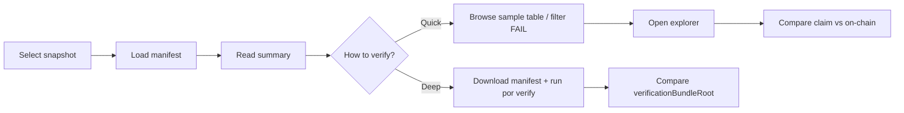
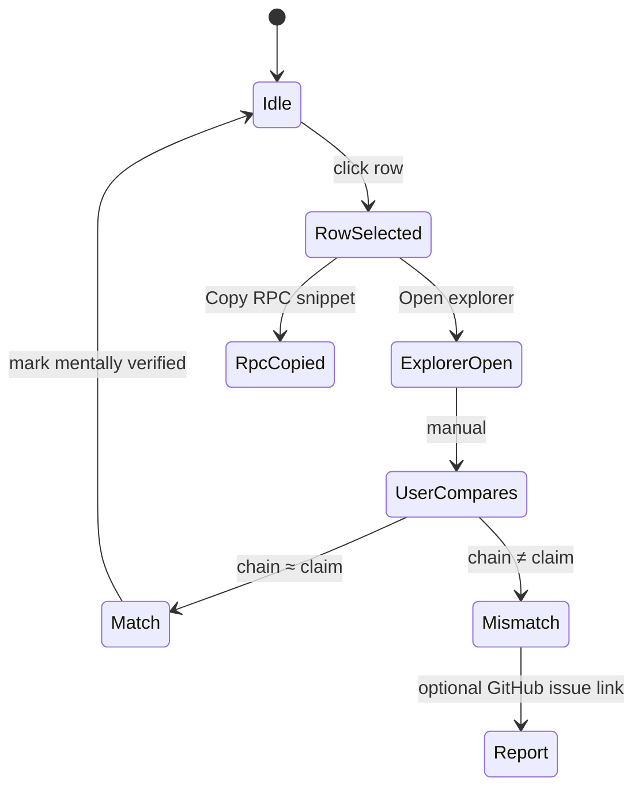

# Deposit Sample Manifest and User Spot-Check Page

> Lets users reproduce ardmere deposit sampling conclusions **without uploading any data**, and independently spot-check any row in about 30 seconds.

| Field | Value |
|------|-----|
| Document version | v1.0 |
| Schema | `ardmere/deposit-sample-manifest@1` |
| Page path | `/verify/deposit/` |
| Related verifier | `onchain-balance-deposit@1.0` |

---

## 1. Design goals

| Goal | Approach |
|------|----------|
| Reproducible | Manifest binds `walletZipSha` + `verificationBundleRoot` + sampling parameters |
| Lightweight verification | User clicks a row → open block explorer / copy RPC command |
| Zero upload | Static JSON via GET only; optional local file picker; data never leaves the browser |
| Honest boundaries | Label `coverage` and chain capabilities (e.g. Solana has no historical slot) |

**Out of scope**: do not run 2M deposit rows in the browser; do not mix private user inclusion zips into this page (that is a separate L3 line).

---

## 2. Artifacts and paths

```
artifacts/<exchange>/<auditId>/
  bundles/
    PR01JUN26.verification-bundle.json
  deposit-sample-manifest.json          ← primary file consumed by the page
  deposit-sample-manifest.schema.json   ← optional, same directory or /schemas/

verify/deposit/
  index.html                            ← spot-check page (static)

config/explorer-links.json              ← per-network explorer URL templates

fixtures/binance/
  PR01JUN26-deposit-manifest.example.json
```

**Published URL example** (GitHub Pages):

```
https://ardmere.github.io/verify/deposit/?manifest=/artifacts/binance/PR01JUN26-20260601-period43/deposit-sample-manifest.json
```

---

## 3. Data format: `deposit-sample-manifest@1`

### 3.1 Top-level structure

```json
{
  "schema": "ardmere/deposit-sample-manifest@1",
  "generatedAt": "2026-06-14T12:00:00Z",
  "generator": "por@deposit-manifest-export@1",

  "snapshot": { ... },
  "artifacts": { ... },
  "sampling": { ... },
  "summary": { ... },
  "networks": { ... },
  "samples": [ ... ]
}
```

### 3.2 Field reference

#### `snapshot`

| Field | Type | Description |
|------|------|------|
| `exchange` | string | `binance` |
| `id` | string | `PR01JUN26` |
| `periodSeq` | int | BAPI period |
| `snapshotTime` | RFC3339 | BAPI snapshot time |
| `merkleRoot` | hex | Exchange liability tree root |

#### `artifacts`

| Field | Type | Description |
|------|------|------|
| `walletZipSha256` | hex | Wallet ZIP content hash |
| `walletZipUrl` | string? | Binance public download URL (reproducible) |
| `bapiSha256` | hex | BAPI summary JSON hash |
| `verificationBundleRoot` | hex | Bundle Merkle root written by the deposit verification run |
| `verifierRef` | string | `onchain-balance-deposit@1.0` |

#### `sampling`

| Field | Type | Description |
|------|------|------|
| `method` | string | Fixed `value_weighted_head` |
| `topKPerCoin` | int | Heap size per coin |
| `maxSamples` | int | Total sample cap |
| `valueCoverageTarget` | float | Target, usually `0.99` |
| `valueCoverageAchieved` | float | Actual achieved (may be below target due to cap) |
| `verifiableDepositRows` | int | Routable exchange-owned rows |
| `unsupportedRows` | int | Rows with no on-chain mapping |

#### `summary`

| Field | Type | Description |
|------|------|------|
| `verdict` | string | `PASS` / `WARN` / `FAIL` / `PARTIAL` |
| `pass` / `warn` / `fail` / `unverifiable` / `rpcError` | int | Sample row counts |
| `reason` | string? | Top-level verifier reason |

#### `networks`

Indexed by `network` key for frontend spot-check guidance (may also be inlined per `sample`).

```json
"ETH": {
  "label": "Ethereum",
  "spotCheckMode": "evm_native",
  "explorerAddress": "https://etherscan.io/address/{address}",
  "explorerBlock": "https://etherscan.io/block/{height}",
  "rpcMethod": "eth_getBalance",
  "rpcParamsTemplate": ["{address}", "{heightHex}"],
  "historicalNote": "Use archive node; compare balance at block {height}."
}
```

`spotCheckMode` enum:

| Mode | Chains | How users verify |
|------|-----|-----------|
| `evm_native` | ETH/BSC/ARB… | Explorer at address @ block, or `eth_getBalance` |
| `evm_erc20` | Same | `balanceOf` @ block + contract in `tokenContract` |
| `utxo` | BTC/LTC/DOGE | Esplora / mempool address page; check confirmed balance |
| `solana_spl` | SOL | Solscan token account; **label live-only limitation** |
| `solana_native` | SOL | Solscan lamports |
| `ledger_other` | XRPL/ALGO… | Free-text `instructions` |

#### `samples[]` (core)

Each row corresponds to one sampled Deposit.csv line that received an on-chain query.

| Field | Type | Required | Description |
|------|------|------|------|
| `id` | string | ✓ | First 16 chars of `sha256(address\|coin\|network\|height)` |
| `address` | string | ✓ | On-chain address |
| `coin` | string | ✓ | Asset symbol |
| `network` | string | ✓ | Network |
| `height` | int | ✓ | CSV `Height` |
| `claim` | string | ✓ | CSV `balance` (decimal string) |
| `actual` | string | | ardmere on-chain observation; omitted on RPC failure |
| `delta` | string | | `actual - claim`; omitted if not measured |
| `verdict` | string | ✓ | Row `PASS/WARN/FAIL/UNVERIFIABLE` |
| `route` | string | ✓ | `native` / `token` / `ledger` |
| `provider` | string | | Successful RPC URL or `cache` |
| `tokenContract` | string | | ERC20 contract when `route=token` |
| `mint` | string | | Mint when `route=ledger` + SPL |
| `explorerUrl` | string | ✓ | Pre-filled explorer link |
| `spotCheck` | object | ✓ | See below |
| `note` | string | | Failure reason or scope note |

`spotCheck` object:

```json
{
  "mode": "evm_erc20",
  "steps": [
    "Open explorer at the block height in the Height column.",
    "Check token balance for contract 0x… at block {height}.",
    "Compare with CSV claim (tolerance 1e-8 relative)."
  ],
  "rpcSnippet": "curl -s $RPC -d '{\"jsonrpc\":\"2.0\",\"method\":\"eth_call\",\"params\":[{\"to\":\"0x…\",\"data\":\"0x70a08231…\"},\"{heightHex}\"],\"id\":1}'"
}
```

### 3.3 Relationship to verification-bundle

```
verification-bundle.json          deposit-sample-manifest.json
├── verifierId: onchain-balance-deposit   ├── full samples[] (with height/claim)
├── findings[] (aggregate + outliers)     ├── explorerUrl + spotCheck guidance
└── coverage                            └── binds artifact hashes (reproducible)
```

**Generation rules**: exporter runs at the end of `por verify`:

1. Read `sample.Rows` from `walletzip.SampleDepositRows`
2. Read `onchain-balance-deposit` findings and join on `subject=address`
3. Merge CSV `height` / `claim` (often missing from findings)
4. Build `explorerUrl` + `spotCheck` from `config/explorer-links.json`
5. Write `deposit-sample-manifest.json`

Planned CLI:

```bash
go run ./cmd/por verify ... --export-deposit-manifest
# or write by default in anchor flow when deposit verifier runs
```

---

## 4. Frontend flow

### 4.1 User journey



### 4.2 Page structure (`/verify/deposit/index.html`)

```
┌─────────────────────────────────────────────────────────────┐
│ ardmere / deposit spot-check                    [GitHub]    │
├─────────────────────────────────────────────────────────────┤
│ SNAPSHOT  PR01JUN26 · Binance · period 43                    │
│ MANIFEST  deposit-sample-manifest.json  sha256:abc…  [⬇]   │
├─────────────────────────────────────────────────────────────┤
│ ┌─────────┐ ┌─────────┐ ┌─────────┐ ┌─────────┐            │
│ │Coverage │ │ Sampled │ │  PASS   │ │  FAIL   │  …       │
│ │ 10.03%  │ │   50    │ │   49    │ │    1    │            │
│ └─────────┘ └─────────┘ └─────────┘ └─────────┘            │
├─────────────────────────────────────────────────────────────┤
│ Filter: [All verdicts ▼] [All coins ▼] [All networks ▼]   │
│ Search: [ address / coin …                          ]       │
├─────────────────────────────────────────────────────────────┤
│ COIN │ NET │ ADDRESS (trunc) │ CLAIM │ ACTUAL │ Δ │ STATUS  │
│ BOME │ SOL │ F3569NwD…      │ 27790 │ 0      │ … │ FAIL   │ →
│ …    │     │                 │       │        │   │        │
├─────────────────────────────────────────────────────────────┤
│ DETAIL PANEL (selected row)                                  │
│  Claim @ height 423478906                                    │
│  [ Open in Solscan ]  [ Copy address ]  [ Copy RPC snippet ]│
│  Spot-check steps:                                          │
│   1. …                                                      │
│  Limitation: Solana live node only — historical slot TBD.   │
├─────────────────────────────────────────────────────────────┤
│ REPRODUCE                                                    │
│  go run ./cmd/por verify -snapshot PR01JUN26 …              │
│  Expected bundle root: 0x9867fe6b…                            │
└─────────────────────────────────────────────────────────────┘
```

### 4.3 Interaction state machine (single-row spot-check)



### 4.4 Three ways to load a manifest

| Method | Scenario | Implementation |
|------|------|------|
| URL parameter | Deep link from audit report | `?manifest=/artifacts/.../deposit-sample-manifest.json` |
| Snapshot dropdown | In-site navigation | Prebuilt `manifests.json` index |
| Local file | Self-exported from verify | `<input type="file">` + `FileReader` |

**CORS**: same-origin load of `artifacts/...` on GitHub Pages is fine. Users opening via local `file://` must use file upload.

### 4.5 In-browser RPC (Advanced, optional tab)

Most public RPC endpoints lack CORS → **do not auto-query chains by default**. Provide only:

- Pre-filled `curl` / `fetch` snippets
- User-supplied RPC URL (remembered in localStorage)
- On success, show `actual` in-page and compare with `claim`

Do not make Advanced the primary path; avoid the misconception that “page RPC failure = do not trust ardmere”.

### 4.6 Accessibility and localization

- All user-facing copy in English (consistent with the landing page)
- Keyboard-navigable table; status not color-only (PASS/FAIL text labels)
- Large numbers in monospace; truncate addresses as `F3569…itEK`

---

## 5. `manifests.json` index (multi-snapshot)

```json
{
  "schema": "ardmere/deposit-manifest-index@1",
  "snapshots": [
    {
      "exchange": "binance",
      "id": "PR01JUN26",
      "auditId": "PR01JUN26-20260601-period43",
      "manifestUrl": "/artifacts/binance/PR01JUN26-20260601-period43/deposit-sample-manifest.json",
      "walletZipDate": "2026-06-01",
      "updatedAt": "2026-06-14T12:00:00Z"
    }
  ]
}
```

---

## 6. Implementation order

| Phase | Work | Output |
|------|------|------|
| P0 | Schema + explorer config + example fixture | this doc + `schemas/` + `fixtures/` |
| P1 | `deposit-manifest` exporter (Go) | JSON written at end of verify |
| P2 | Static page `verify/deposit/index.html` | load + table + detail panel |
| P3 | `manifests.json` index + audit report deep links | one-click jump from audit report |
| P4 | Advanced RPC tab | optional |

---

## 7. Security and privacy

- Manifest contains only **Binance-published** addresses and balances; no user identity data
- No backend, no analytics upload, no zip upload
- `verificationBundleRoot` lets users compare against on-chain anchor; it does not replace legal audit

---

## 8. Related documentation

- [binance-por-data-guide.md](./binance-por-data-guide.md) §6.4–6.6 (L1/L2/L3 layering)
- [verifier-architecture.md](./verifier-architecture.md) §7.5 (deposit sampling SLA)
- [schemas/deposit-sample-manifest.v1.schema.json](../schemas/deposit-sample-manifest.v1.schema.json)
