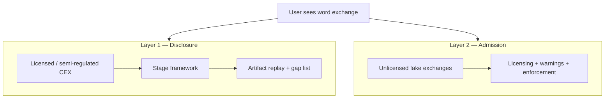

# Exchange Reserve Transparency Whitepaper

**Effective Proof-of-Reserves, Stage Framework, and Policy Roadmap**

| Field | Value |
| --- | --- |
| **Version** | 1.1 (2026-07-01) |
| **Author** | ardmere |
| **Status** | Working draft |
| **Primary audience** | Regulators, institutional allocators, independent reviewers, exchange compliance teams |
| **Secondary audience** | Retail users (Chapter 11.5) |

> **Legal disclaimer.** This document is an independent transparency and policy analysis. It is not investment advice, a custody recommendation, or an endorsement of any exchange. Public ratings bind to artifacts and verifier output; they do not guarantee solvency or safety.

---

## Executive Summary

When users deposit crypto on a centralized exchange (CEX), they receive an **IOU** on the exchange ledger—not on-chain coins under their private keys. History has repeatedly shown that displayed balances can be wrong, incomplete, or unbacked. After the collapse of FTX in November 2022, Proof of Reserves (PoR) declarations spread rapidly across major exchanges. That wave improved **narrative** transparency but did **not** end custodial risk.

### Four judgments that run through this whitepaper

1. **FTX did not end CeFi custody risk.** Major freezes, hacks, fraud, and trust crises continued from 2023 through 2026 (AAX, JPEX, WazirX, 2139 Exchange, CoinUp, and others).
2. **The post-FTX PoR wave concentrated on Layer 1 (disclosure).** Many post-FTX victims used **unlicensed or fake “exchanges”** (Layer 2). Binance/OKX PoR debates and JPEX-style fraud are **different risk layers** and must not be conflated.
3. **PoR narrative does not prevent crisis freezes.** Regional exchanges can halt withdrawals within hours under trust shocks (AAX). Without PoR, rumors alone can trigger run expectations (CoinUp). PoR does not replace liquidity, security operations, or governance resilience.
4. **Effective PoR is not a panacea, but gaps can be named.** Many failed platforms never offered independently verifiable disclosure. Standards should (**a**) constrain exchanges capable of disclosure, and (**b**) help users recognize platforms with **no** credible custody evidence.

### Dual-layer risk model

| Layer | Typical objects | Main failure modes | Role of this whitepaper |
| --- | --- | --- | --- |
| **Layer 1 — Disclosure** | Licensed or semi-regulated CEXs (Binance, OKX, AAX, WazirX, …) | Weak disclosure, Stage 0 marketing, crisis freezes, post-hack inability to recover | **Primary scope:** Stage framework, `UNVERIFIABLE` gaps, Stage 1 policy floor |
| **Layer 2 — Admission** | Unlicensed fake “exchanges,” Ponzi fronts, OTC referral scams (JPEX, 2139, long-tail freeze sites) | Never held real reserves; fake regulation; exit scams | **Not a PoR tech problem:** licensing, enforcement, public warnings; user habit: **no public artifact = no custody guarantee** |

### Policy conclusions

- **Stage 0 is not effective PoR. Stage 1 is the minimum policy threshold** for Layer 1 exchanges.
- **Financial audit and PoR audit are dual-track complements**—a clean audit opinion does not imply effective PoR (Chapter 5).
- Every public rating must bind **artifacts, hashes, verifier output**, and explicit **`UNVERIFIABLE`** gaps—not marketing slogans.
- Regulators and institutions must address **disclosure quality and platform admission** together. Focusing only on headline PoR pages leaves Layer 2 untouched.

### Stage at a glance

| Stage | Name | Effective PoR? | User still trusts (primarily) |
| --- | --- | --- | --- |
| Pre-Stage | No usable PoR | No | Brand, financial reports, regulation |
| Stage 0 | Trust the exchange | No | Exchange narrative |
| **Stage 1** | **Verifiable disclosure** | **Yes (minimum)** | Proof boundaries, historical artifact maintenance |
| Stage 2 | Trust-minimized PoR | Yes (aspirational) | Cryptography, public data, canonical on-chain records |

**Current industry snapshot (ardmere public evaluation set, mid-2026):** OKX reaches **Stage 1** on assessed snapshot `508399035` (Jun 2026); Binance, Bybit, Bitget, Gate.io, and HTX remain **Stage 0** with documented gaps. See [Chapter 10](#chapter-10-assessed-exchanges-public-evaluation-set) and [snapshot history](https://ardmere.github.io/docs/reports/snapshot-history.html).

### Reader paths

| Reader | Start here | Also read |
| --- | --- | --- |
| Regulators / policy | Executive Summary, Ch. 5, 7, 8, 11 | Ch. 3, Appendix H |
| Institutions / risk | Executive Summary, Ch. 5, 7, 9 | Ch. 10, Appendix A |
| Exchange compliance | Ch. 5, 6, 7, 8 | Ch. 9, Appendix A |
| Independent reviewers / media | Ch. 3, 5, 6, 9 | Appendix C–E, H |
| Retail users | Executive Summary, Ch. 1–3, **Ch. 11.5** | Ch. 10 (gaps only); **do not** rely on exchange PoR marketing alone |

---

# Part I — Where the Problem Comes From

## Chapter 1 — The User View: What You Actually Hold on an Exchange

### 1.1 After you deposit

On-chain assets move into exchange-controlled wallets. Your account balance is a **liability entry** on the exchange’s books—an IOU. You do not control those coins with your keys until you withdraw. Legally and technically, you are often an **unsecured or specially treated creditor**, depending on jurisdiction—not a bailor who “owns coins in a vault.”

### 1.2 Six common misconceptions

| User intuition | Reality |
| --- | --- |
| “Large platforms must be safe.” | Scale ≠ reserve transparency. The largest venues have also failed. |
| “Listed or audited means my balance is verified.” | Financial audit addresses **company** financial statements, not necessarily your account inside a verifiable liability set. |
| “I can log in and withdraw, so I’m fine.” | Bank runs favor first movers; withdrawal halts often arrive without warning. |
| “A PoR announcement = 100% reserves.” | Many PoR programs cover partial assets/liabilities or cannot be independently reproduced. |
| “After FTX, the industry learned.” | 2023–2026 still saw AAX, JPEX, WazirX, CoinUp-scale events; the PoR wave did not reach unlicensed Layer 2 platforms. |
| “Official denial + normal deposits/withdrawals = no problem.” | Without effective PoR, users cannot independently verify; denials are not substitutes for artifacts (CoinUp, June 2026). |

### 1.3 Runs and liquidity

CEX balances feel like demand deposits. In stress, everyone wants out at once. Exchanges may impose queues, “maintenance,” or full halts—sometimes within **hours** (FTX, AAX). Annual financial audits are too slow for this risk profile; users need **shorter-cycle snapshots** with public evidence.

### 1.4 Bankruptcy

In insolvency, users typically join a **creditor queue**, not a “return my property” line. Customer-asset segregation rules vary by country. **PoR does not change bankruptcy law**; it provides **ex-ante evidence** about whether liabilities were backed at a defined snapshot.

### 1.5 Self-custody and PoR

PoR improves **custodial transparency**; it does not eliminate the choice to self-custody. Lost private keys have no bankruptcy court. Policy should understand **both** paths: self-custody shifts key risk to the user; CEX custody shifts IOU and platform risk to the user.

### 1.6 Closing thought

> Users do not need slogans. They need **public evidence before a crisis** that what the platform owes them is covered by assets the platform controls—evidence outsiders can fetch and re-verify.

---

## Chapter 2 — Industry History: From “Trust the Platform” to “Show Evidence”

### Four phases

| Phase | Period | Theme | What users learned (in hindsight) |
| --- | --- | --- | --- |
| **I** | 2010–2014 | Early custody: exchange as on-ramp; no disclosure culture | “Balance on screen” was unchecked |
| **II** | 2015–2019 | Hacks and insolvencies; PoR still not routine | Even surviving giants could socialize losses |
| **III** | 2020–H1 2022 | CeFi expansion, earn/leverage, hidden rehypothecation | Spot balance ≠ all economic exposure |
| **IV** | H2 2022–present | FTX → PoR declaration wave → uneven quality; failures continue | PoR PR ≠ end of freezes or fraud |

### Timeline (selected)

```
2013–14  Merkle liability-proof ideas │ Mt. Gox
2016     Bitfinex hack │ socialized loss
2018–19  Coincheck, QuadrigaCX
2020     Early CEX PoR experiments (e.g. Gate.io)
2022.02  Kraken systematic PoR audits
2022.06  3AC collapse → CeFi contagion
2022.11  FTX │ industry-wide PoR surge
2022.11  AAX withdrawal freeze (immediate aftershock)
2023     JPEX (Hong Kong)
2023+    zk-SNARK/STARK PoR at major venues
2024.07  WazirX hack + governance crisis
2024.09  2139 Exchange-style exit scams
2026.06  CoinUp “exit” rumors & trust crisis (unconfirmed shutdown)
```

Phase IV closes with a pivot to **dual-layer risk** (Chapter 3.3): PoR marketing spread among Layer 1 headlines while Layer 2 scams continued under the same word “exchange.”

---

## Chapter 3 — Major Cases: What Users Paid

### 3.1 Before FTX (selected)

| Case | Year | User harm | Lesson |
| --- | --- | --- | --- |
| **Mt. Gox** | 2014 | Years-long withdrawal freeze; partial repayment | Displayed balances can be wrong for years |
| **Bitfinex** | 2016 | Socialized loss (BFX token) | “Too big to fail” still hurts users |
| **QuadrigaCX** | 2019 | Long freeze; cold wallets effectively empty | “Only CEO knows keys” is unacceptable |
| **3AC / CeFi chain** | 2022 | Contagion through opaque leverage | Deposits may fund upstream risk |
| **Celsius et al.** | 2022 | Earn freezes | Spot PoR scope may exclude earn liabilities |
| **FTX** | 2022.11 | Rapid halt; bankruptcy recovery | Brand, funding, partial audit ≠ verifiable reserves |

### 3.2 After FTX: failures and “exits” continued

**Conclusion to state plainly:** FTX did not end CeFi custody risk. After November 2022, users still faced freezes, hacks, fraud, and trust crises—different mechanisms, same user predicament: **no independent verification before the event; creditor treatment after.**

#### Type A — Regional CEX: freeze then effective shutdown

**AAX (Atom Asset Exchange), from Nov 2022:** Hong Kong venue; cited “system maintenance” to halt withdrawals after FTX; later delisted social channels, offices closed; liquidation and criminal investigations alleging large outflows during the “maintenance” period. ~2M users affected per public reports. PoR wave had barely started; users could not verify “no FTX exposure” claims.

#### Type B — Unlicensed / fraudulent “exchanges”

**JPEX (2023):** Unlicensed in Hong Kong; offline promotion and high-yield narratives; SFC warnings; withdrawal friction then collapse. **No effective PoR**—Layer 2 admission failure, not a Binance Stage 0 debate.

**2139 Exchange (2024):** CONSOB blocking orders; Ponzi-like yields; mass withdrawal freeze and on-chain outflows. **No real trading or reserve program**—fraud, not disclosure tuning.

#### Type C — Security + governance failure

**WazirX (from Jul 2024):** ~$230M multisig hack; trading/withdrawals suspended; restructuring disputes. Not classic embezzlement, but **user outcome resembles a run**—brand history did not prevent long freezes.

#### Type D — Long-tail fake exchanges

Patterns like OrangeX complaints: deposits accepted, withdrawals blocked behind endless KYC/fees—often Layer 2; PoR standards do not audit platforms that never intended to pay.

#### Type E — Unconfirmed exit / trust crisis (platform still operating)

**CoinUp (Jun 2026):** Derivatives venue; public warnings involving associated persons; “exit” rumors; CPX token sell pressure; official denials of shutdown and claims of normal deposits/withdrawals. **No independently reproducible effective PoR** at time of writing; users relied on announcements. **Not confirmed as shutdown**—classify as trust crisis until regulatory/judicial findings change.

*Writing rule:* do not label Type E as “confirmed exit” without primary sources; footnote dated press reports.

### 3.3 Cross-case conclusions: dual-layer risk and PoR limits

The [Executive Summary](#executive-summary) dual-layer table and four judgments apply across Types A–E. Case-specific emphasis:

- **Type A (AAX):** PoR narrative had barely started; users could not verify “no FTX exposure” before the freeze.
- **Type B (JPEX, 2139):** Layer 2 admission failure—no artifact path to Stage 0 debate.
- **Type C (WazirX):** Effective PoR does not prevent hacks or governance breakdowns.
- **Type E (CoinUp):** Without reproducible artifacts, official denials cannot substitute for evidence.

**Do not** treat every post-FTX failure as “PoR failure.” **Do not** use Layer 2 fraud to dismiss Layer 1 disclosure standards.

---

## Chapter 4 — Rise of PoR: From Ideas to Marketing Language

### 4.1 Origins (2013–2014)

Merkle-sum trees and early **proof-of-solvency** research combined **liability commitments** with **reserve evidence**, enabling privacy-preserving aggregation.

### 4.2 Early practice (2020–2022.2)

Venues such as Gate.io and Kraken systematized Merkle-based approaches; adoption remained uneven.

### 4.3 Post-FTX declaration wave (from Nov 2022)

Merkle and zk-SNARK PoR became standard PR. Technical capability improved; **policy-grade reproducibility** often did not.

### 4.4 Six gaps between marketing and verification

| Marketing phrase | What outsiders can actually verify |
| --- | --- |
| “Audited” | Financial audit or reproducible PoR artifacts? |
| “Reserve ratio > 100%” | Which liabilities included (earn, margin, sub-accounts)? |
| “Verify your own proof” | Inclusion only ≠ exchange-wide solvency |
| “ZK verified” | If wallet lists / vk / global proof not public → cannot rerun |
| “We all did PoR after FTX” | Existence of a page ≠ third-party reproduction; Layer 2 never did |
| “Industry is transparent now” | AAX/JPEX/WazirX/CoinUp timeline contradicts blanket safety |

### 4.5 What PoR can and cannot do (preview)

| Effective disclosure helps with | PoR alone does not solve |
| --- | --- |
| Snapshot-bound, reproducible reserve/liability evidence | Layer 2 licensing and fraud enforcement |
| Separating Stage 0 marketing from Stage 1 thresholds | Hacks, multisig failures (WazirX class) |
| Naming `UNVERIFIABLE` gaps | Liquidity crises and withdrawal queues |

### 4.6 Transition to Part II

Headline PoR quality remains uneven; fake platforms still acquire users under the word “exchange.” **Why PoR audit must complement financial audit** → Chapter 5. **Operational Stage standards** → Chapters 6–8.

### 4.7 Literature note

Academic proof-of-solvency work dates to ~2015; Vitalik’s 2022 “safe CEX” essay and major-venue zk/Merkle specs mark a second wave. IOSCO, Hong Kong SFC, and others address **custody and client-asset rules** but do not define an **Effective PoR / Stage** framework like this document. See [Appendix H](#appendix-h-industry-references-and-positioning).

---

# Part II — Standards for Effective Disclosure

## Chapter 5 — Why CEXs Need PoR Audit: Dual-Track with Traditional Audit

### 5.1 Two meanings of “audit”

| Term | This whitepaper means | Typical output | Typical performer |
| --- | --- | --- | --- |
| **Traditional audit** | Reasonable assurance on **financial statements** | Audit opinion, going concern, ICF | Licensed accounting firm |
| **PoR audit / review** | Verification that **customer liabilities** under a defined snapshot are covered by reserves per disclosed scope | Artifacts, Merkle/zk proofs, verifier output, AUP | Accounting AUP, security firm, technical reviewer |

Colloquial “PoR audit” must not be read as **financial statement audit with a different name**.

### 5.2 Six reasons users and regulators need PoR audit

**① Withdrawals can happen anytime—runs are fast.**  
Balances feel like demand deposits; crises unfold in days or hours. Annual audits are misaligned with user timing risk.

**② Money sits in many places—“company has assets” ≠ “your coins exist.”**  
Reserves span hot/cold wallets, staking, earn, affiliates. Financial statement line items do not automatically prove **customer-level** backing.

**③ Technology allows public liability commitments.**  
Merkle trees and zk systems can commit to **total user liabilities** while letting each user check inclusion—something traditional audit does not typically expose for public rerun.

**④ Crises happen between audit periods.**  
FTX and Celsius showed months-long windows where a prior clean opinion did not protect customer funds.

**⑤ Marketing outruns evidence.**  
“100% backed,” “audited,” “ZK verified” are often misread as personal safety. PoR audit decomposes slogans into **downloadable, rerunnable** materials—or marks gaps `UNVERIFIABLE`.

**⑥ Audit process is not publicly rerunnable (complement to ⑤).**  
Financial audit relies on professional independence and workpapers users never see. Effective PoR adds **public evidence** for custody-specific claims—not an accusation of audit fraud, but a different trust boundary.

### 5.3 Summary table

| User concern | Traditional audit usually covers | PoR audit adds |
| --- | --- | --- |
| Can I withdraw? | Going concern at entity level | Snapshot: liabilities vs reserves in scope |
| Where are coins? | “Digital assets” on balance sheet | Concrete addresses + control proofs |
| Is my balance counted? | Generally not user-verifiable | Liability commitment + inclusion path |
| Last year was clean—am I safe now? | Periodic (quarter/year) | Shorter snapshot cadence + archives |
| “100% reserves” true? | Does not auto-verify on-chain slogans | Artifacts + explicit gaps |

> CEXs sell **custody and redemption**, not an annual report alone. Users and regulators need to know **what is owed to customers and whether outsiders can check**—that is the purpose of PoR audit.

### 5.4 Clean financial audit still requires effective PoR

> Financial audit asks whether **company accounts are fairly stated**. Effective PoR asks whether **customer liabilities are backed and outsiders can verify**. A clean opinion on the former **does not imply** the latter.

| Dimension | Financial audit | Effective PoR |
| --- | --- | --- |
| Question | Are statements fair? | Are scoped liabilities backed at a snapshot? |
| User-level rerun | Generally no | Core artifacts should be public |
| Interval | Quarter/year | Monthly or better for custody evidence |
| “Audited” slogan | Entity financials | Must not subsume PoR scope |

**FTX (2022.11):** Audit ecosystem and reputation coexisted with customer fund commingling—illustrating why custody needs **its own** reproducible track.

### 5.5 Five common misuses

| Misuse | Harm | Correct framing |
| --- | --- | --- |
| Financial audit opinion = effective PoR | False safety on custody | Dual-track disclosure |
| User inclusion only | “I verified me” ≠ whole exchange | State global proof / wallet artifacts |
| Third-party AUP on BTC only | Narrow asset window | Disclose scope and exclusions |
| “Big Four audited PoR” | Brand laundering | Name review **type** and artifacts |
| ZK marketing without public vk/bundle | `LOGIN_WALL` / `UNVERIFIABLE` | Stage 0 cap |

### 5.6 Report taxonomy (do not conflate)

| Type | Shows |
| --- | --- |
| Technical verification | Artifacts reproducible |
| AUP / agreed-upon procedures | Steps performed; usually no overall assurance |
| Limited assurance | Limited scope on defined procedures |
| Reasonable assurance / financial audit | Company financials; may exclude PoR liability scope |

---

## Chapter 6 — Concepts and Terminology

### 6.0 Terminology chain

```
Disclosure → PoR audit / review → Effective PoR (Stage 1+) → Public Stage record
```

| Term | Meaning | Common misuse |
| --- | --- | --- |
| **Has PoR** | Published a page or one-off proof | ≠ effective PoR |
| **PoR audit** | Third-party work on snapshot materials | ≠ financial audit |
| **Effective PoR** | Independently reproducible global core evidence (Stage 1+) | ≠ no risk, ≠ going concern |
| **Stage rating** | Primary maturity label | Gen/E lenses do not upgrade Stage |

### Three data planes (keep separate)

1. **Reserve side:** `wallet_address_list`, block heights, `wallet_ownership_proof`
2. **Liability side:** `global_proof`, root/vk/config, inclusion proofs
3. **Summary side:** reserve ratios, scope, cross-binding to (1) and (2)

### 6.1 Auxiliary lenses: Gen and E Level

**Stage is the primary public label.** Gen and E Level are explanatory lenses only—they **do not upgrade Stage** and must not be marketed as parallel ratings.

| Lens | Question it answers | Levels (summary) |
| --- | --- | --- |
| **Gen** (technology generation) | What proof technology does the exchange use? | **Gen 0:** no PoR · **Gen 1:** Merkle inclusion · **Gen 2:** Merkle + global ZK · **Gen 3:** advanced / continuous (aspirational) |
| **E Level** (evidence availability) | How much can outsiders obtain and rerun? | **E0:** no usable artifacts · **E1:** summary and/or inclusion only · **E2:** key artifacts public and reproducible · **E3:** E2 + anchoring, DA, low-friction inclusion, high frequency (Stage 2 candidate) |

**Common misread:** **Gen 2 + E2 ≠ Stage 1.** Binance publishes Gen 2–class marketing and partial E2 artifacts (`summary`, `wallet_address_list`) but remains **Stage 0** when `wallet_ownership_proof`, `global_proof`, and `vk/config` are not permissionlessly available (Chapter 10).

### 6.2 Verifier verdicts

Independent reruns should use explicit outcomes—never treat silence as approval:

| Verdict | Meaning |
| --- | --- |
| **PASS** | Check succeeded on public artifacts for the bound snapshot |
| **FAIL** | Check failed; artifact or claim inconsistent |
| **WARN** | Partial pass with material caveats (scope, RPC, timing) |
| **UNVERIFIABLE** | Required input missing or not independently obtainable—**not PASS** |

Floor flags (e.g. `LOGIN_WALL`, `NO_WALLET_OWNERSHIP_PROOF`) cap Stage or confidence when triggered. See [Appendix B](#appendix-b--machine-readable-rules).

---

## Chapter 7 — PoR Stage Framework

*Philosophy borrowed from [L2BEAT Stages](https://l2beat.com/stages): **Stage measures trust minimization, not a security seal.** Domain differs: CEX reserves, not L2 rollups.*

### 7.1 Stage overview

| Stage | Name | Effective PoR? | User still trusts |
| --- | --- | --- | --- |
| Pre-Stage | No usable PoR | No | Brand, reports, regulation |
| Stage 0 | Trust the exchange | No | Exchange narrative |
| **Stage 1** | **Verifiable disclosure** | **Yes (minimum)** | Proof boundaries, artifact maintenance |
| Stage 2 | Trust-minimized | Yes (target) | Crypto + public data + canonical records |

### 7.2 Pre-Stage and Stage 0

**Pre-Stage (any):** No public PoR in 12 months; PoR stopped; marketing only; financial reports without PoR artifacts; on-chain treasury display without liability side.

**Stage 0 (all):** Ongoing disclosure; snapshot boundaries; at least summary or user inclusion; exportable inclusion if offered; open-source verifier or spec.

**Typical Stage 0 blockers:** no public `wallet_address_list`, `wallet_ownership_proof`, or `global_proof`; opaque trusted setup; login-walled bundles.

### 7.3 Stage 1 — minimum effective PoR (all required)

| ID | Requirement |
| --- | --- |
| S1-1 | Meets all Stage 0 thresholds |
| S1-2 | Public `wallet_address_list` + block height, on-chain checkable |
| S1-3 | Public batch-verifiable `wallet_ownership_proof` |
| S1-4 | Public `global_proof` + root/vk/config, locally rerunnable; **no login wall** on liability side |
| S1-5 | **Permissionless download** of **all** core artifacts: `summary`, `wallet_address_list`, `wallet_ownership_proof`, `global_proof`, `vk/config`—no registration, login, cookies, API key, ticket, or manual approval |
| S1-6 | Independent third-party review with **type disclosed** |
| S1-7 | summary ↔ reserve aggregate and summary ↔ liability root **cross-bound** |
| S1-8 | Public trusted-setup transcript **or** transparent-setup proof system |
| S1-9 | Historical snapshots archivable, not only current webpage |
| S1-10 | **Proof boundary** documented: covered vs excluded liabilities (earn, margin, off-balance-sheet) |

**S1-5 emphasis:** Independent reviewers, media, regulators, and the public must fetch the **same** artifact set **without an account relationship**. VIP-only bundles, reviewer-only packages, or split-view releases cap at **Stage 0** (`LOGIN_WALL` floor)—even if other items pass.

**Stage 1 equivalent statement:**

> Aside from implementation bugs and collusion, a third party that long-term fails to detect forged solvency must rely on the exchange replacing artifacts or reviewer collusion—not on “the exchange says it controls these addresses.”

**Reference implementation in public set:** OKX snapshot `506872725`.

### 7.4 Stage 2 — trust-minimized PoR (directional target)

No complete industry instance at time of writing. Stage 2 builds on **all** Stage 1 requirements plus the following hard thresholds:

| ID | Requirement |
| --- | --- |
| S2-1 | Meets all Stage 1 thresholds |
| S2-2 | **Business-consistent constraints** — proof covers actual business risk (lending, margin, collateral haircuts, etc.); no negative-net-worth dummy users or liability offset |
| S2-3 | **On-chain anchoring** — root / proof commitment on-chain with non-deletable historical chain |
| S2-4 | **Data availability** — proof packages, vk, config, `wallet_address_list` on stable public layer (on-chain, IPFS, DA) |
| S2-5 | **Low-friction user verification** — exportable inclusion proof with Web/WASM/GUI path bound to public root |
| S2-6 | **Permissionless replay** — core verification without login or API key; prefer on-chain verifier when ZK is used |
| S2-7 | **Parameter and version anchoring** — vk/config/verifier version commitments on-chain/DA with audit trail |
| S2-8 | **Anti-timing frequency** — e.g. weekly full PoR + daily root anchoring + event-triggered updates; monthly-only snapshots insufficient |
| S2-9 | **Review independence** — reviewer vs technology-provider conflicts disclosed |

**Stage 2 equivalent statement:**

> Any user can low-barrier verify inclusion; any observer can verify the canonical root for the period; proof constraints reflect real business risk; the exchange cannot unilaterally rewrite anchored history or extend unproven windows.

**Third-party archiving ≠ official Stage 2.** Observer anchors prove “this third party saw these artifacts,” not exchange-operated canonical anchoring.

### 7.5 Business consistency and risk flags

| Risk theme | Concern | Typical flag |
| --- | --- | --- |
| Negative-net-worth dummy users | Inflated solvency | Stage 2 constraints |
| Lending/margin outside proof | Scope < real risk | `scope.exclusions` |
| Earn vs spot conflation | User confusion | Ch. 1, 8 linkage |
| Login wall / sample-only | Apparent PoR, Stage 0 | `LOGIN_WALL`, `SAMPLE_ONLY` |
| No ownership / opaque setup | Reserve side untrusted | `NO_WALLET_OWNERSHIP_PROOF` |
| Server-only hosting | History rewrite | `NO_CANONICAL_ANCHOR` |
| Monthly-only snapshots | Timing window | Stage 2 frequency |

### 7.6 Gap discipline and confidence

- **`UNVERIFIABLE` ≠ PASS**
- Ratings bind to a **specific snapshot ID**
- **Floor rules:** weakest link caps Stage or lowers confidence
- Single-user inclusion PASS ≠ exchange-wide solvency PASS

---

## Chapter 8 — Minimum Effective PoR Policy (Actionable Clauses)

### 8.1 Layer 1 (disclosure track)

- **Stage 1** is the minimum for licensing, institutional counterparty lists, and public registry **effective PoR** claims.
- **Stage 0** must be labeled as relying primarily on exchange narrative.
- **S1-5 permissionless download** is a standalone checklist item for supervisors.

### 8.2 Layer 2 (admission track)

Stage ratings **do not apply**. Tools: licensing, warnings, domain/payment blocks, criminal enforcement. User education: **no public artifact → treat as no custody guarantee** (Chapter 11.5).

### 8.3 Do not conflate

- JPEX-style fraud does not invalidate Stage framework for Layer 1.
- Binance PoR marketing does not protect users from Layer 2 scams.

---

# Part III — How to Verify

## Chapter 9 — Evidence Chain and Independent Verification

### 9.1 End-to-end flow

```
Exchange publishes artifacts
  → Content-addressed capture (URL, fetch time, content hash)
  → Independent verifier rerun (PASS / FAIL / WARN / UNVERIFIABLE)
  → Artifact bundle root + verification bundle root
  → Optional on-chain anchor (digest only, not bulk data)
  → Public report + gap list bound to snapshot ID
```

Each public rating must answer: **which snapshot**, **which artifacts**, **which verifier version**, **which gaps remain**.

### 9.2 Step 1 — Permissionless artifact fetch (S1-5 test)

From a clean browser session **with no exchange account**:

1. Locate the exchange’s public PoR landing page or API index for the **current snapshot ID**.
2. Attempt direct download of all core artifacts: `summary`, `wallet_address_list`, `wallet_ownership_proof`, `global_proof`, `vk/config`.
3. Record HTTP status, file hashes, and fetch timestamp. Any registration, login, cookie gate, API key, ticket, or manual approval → **`LOGIN_WALL` floor** (Stage 0 cap).

### 9.3 Step 2 — Verifier rerun

1. Obtain the exchange’s **open-source verifier** or published algorithm spec (Appendix H.3).
2. Run reserve-side checks: address list vs on-chain balances at declared block height; `wallet_ownership_proof` batch verification.
3. Run liability-side checks: `global_proof` + `vk/config` locally; cross-bind `summary` ↔ reserve aggregate ↔ liability root.
4. If user `inclusion_proof` is tested, confirm it binds to the **same** public root—single-user PASS ≠ exchange-wide solvency PASS.

### 9.4 Step 3 — Record and publish

Bind the assessment to:

| Field | Purpose |
| --- | --- |
| Snapshot ID + snapshot time | Scope boundary |
| Artifact URLs + SHA-256 hashes | Reproducibility |
| Verifier name + version | Method transparency |
| Per-check verdicts | PASS / FAIL / WARN / UNVERIFIABLE |
| Floor flags + max Stage | Weakest-link caps |
| Confidence | medium / low when friction or partial RPC |

### 9.5 Worked example — OKX Stage 1 snapshot `506872725`

Illustrative sequence (mid-2026 public evaluation set):

1. **Anonymous fetch:** Download `summary`, `wallet_address_list`, `wallet_ownership_proof`, `global_proof`, and `vk/config` from OKX public PoR endpoints without logging in.
2. **Reserve side:** Verify address signatures in `wallet_ownership_proof`; reconcile listed addresses to on-chain balances at the declared snapshot boundary (expect some `WARN`/`UNVERIFIABLE` on exotic chains or omnibus labels).
3. **Liability side:** Run the OKX open-source global ZK verifier (`github.com/okx/proof-of-reserves-v2`) against the public bundle; confirm `summary` Merkle root matches `global_proof` commitment.
4. **Stage call:** All S1-1–S1-10 hard thresholds met → **Stage 1** / effective PoR **Yes**, with confidence **medium** (no official canonical on-chain anchor, monthly cadence vs Stage 2 frequency, business-constraint gaps).
5. **What this does not prove:** No freeze immunity, no hack protection, no coverage of earn/margin outside documented proof boundary.

### 9.6 Boundaries

1. Third-party archive anchors prove **“this observer saw these artifacts”**—not official Stage 2.
2. Ratings are **evidence records** bound to artifacts, hashes, and verifier output.
3. Coverage gaps (e.g. partial on-chain RPC failures) **≠** proof of insolvency.

### 9.7 Independent registry role (ardmere)

| Function | Description |
| --- | --- |
| Transparency registry | Reproducible verifier toolchain and public Stage records |
| Evidence binding | Each record links artifacts, content hashes, and verifier output |
| Policy use | Reference index for regulators, institutions, and independent reviewers |

ardmere does not hold user funds, issue licenses, or perform financial statement audits. Empirical exchange assessments for the public evaluation set are in [Chapter 10](#chapter-10-assessed-exchanges-public-evaluation-set).

---

# Part IV — Industry State and Path Forward

## Chapter 10 — Assessed Exchanges (Public Evaluation Set)

### 10.1 Scope

This chapter covers exchanges in the **ardmere public evaluation set**—venues with published transparency assessments and machine-readable evaluation records (`exchange-assessment@1` schema). It is **not** an industry-wide ranking: Kraken, Coinbase, and others are out of scope unless separately assessed.

**Exclusion from scoreboard:** JPEX, 2139, CoinUp (Layer 2 or Type E)—discussed in Chapter 3, not ranked alongside Layer 1.

**Forward-looking note:** Stages bind to **specific snapshot IDs and assessment dates**. A Stage label does not predict future snapshots, operational safety, or solvency.

### 10.2 Summary table (mid-2026)

| Exchange | Snapshot | Assessed | Stage | Gen / E | Effective PoR | Headline gaps |
| --- | --- | --- | --- | --- | --- | --- |
| **OKX** | `508399035` | 2026-06-18 | **Stage 1** | Gen 2 / E2 | Yes | No canonical anchor; monthly cadence; business-constraint gaps vs Stage 2 |
| **Binance** | `PR01JUN26` | 2026-06-01 | Stage 0 | Gen 2 / E2 | No | No public `wallet_ownership_proof`, `global_proof`/vk; opaque trusted setup |
| **Bybit** | `2025061709` | 2025-06-17 | Stage 0 | Gen 1 / E1 | No | Inclusion path only; no public wallet list or global proof |
| **Bitget** | `202605` | 2026-05-27 | Stage 0 | Gen 1 / E1 | No | Weak 64-bit Merkle; no wallet list / global proof |
| **Gate.io** | `20260316` | 2026-03-16 | Stage 0 | Gen 1 / E1 | No | Summary public; zk bundle login-gated; no wallet list |
| **HTX** | `20230910` | 2023-09-10 | Stage 0 | Gen 1 / E1 | No | 2023 sample zk only; no current production public bundle |

### 10.3 OKX — Stage 1 reference (`506872725`)

- **Passes:** Public `wallet_address_list`, `wallet_ownership_proof`, `global_proof`, `vk/config`; S1-5 permissionless download; global ZK binding reproducible with open-source verifier.
- **Blocks Stage 2:** `NO_CANONICAL_ANCHOR`, `HIGH_FRICTION_INCLUSION_PROOF`, `BUSINESS_CONSTRAINT_GAP`, `HIGH_FREQUENCY_GAP`.
- **Policy read:** Current best public reference for **minimum effective PoR** among assessed majors—not a safety seal.

### 10.4 Binance (`PR01JUN26`)

- **Partial S1-5 (Jun 2026):** `summary` and `wallet_address_list` permissionlessly downloadable via public BAPI; **`wallet_ownership_proof`, `global_proof`, and `vk/config` are not** → fails S1-5, remains Stage 0.
- **Flags:** `NO_WALLET_OWNERSHIP_PROOF`, `OPAQUE_TRUSTED_SETUP`, `UNVERIFIABLE` on global ZK stack.
- **Upgrade P0:** Publish ownership proof + permissionless global proof/vk + trusted-setup transcript (Chapter 11.3).

### 10.5 Bybit (`2025061709`)

- **Available:** Summary-style reserve ratio; user Merkle inclusion replayable on supplied test vector (`github.com/bybit-exchange/merkle-proof`).
- **Missing:** Public `wallet_address_list`, `wallet_ownership_proof`, `global_proof`.
- **Misread to avoid:** “I verified my leaf” ≠ exchange-wide solvency.

### 10.6 Bitget (`202605`)

- **Available:** Summary + optional user inclusion under Gen 1 Merkle scheme.
- **Defect:** 64-bit truncated SHA-256 in public verifier weakens collision resistance.
- **Missing:** Public wallet list, ownership proof, global proof.

### 10.7 Gate.io (`20260316`)

- **Available:** Public reserve-ratio summary.
- **Blocked:** ZK bundle behind login; no public `wallet_address_list` or `wallet_ownership_proof` → `LOGIN_WALL` / `NO_GLOBAL_PROOF` class gaps.

### 10.8 HTX (`20230910`)

- **Stale sample:** 2023 zk sample verifiable in isolation; **no current production public bundle** in the evaluation pipeline.
- **Missing:** Contemporary `wallet_address_list`, ownership proof, and permissionless global proof for ongoing operations.

Official upstream verifier repositories are listed in [Appendix H.3](#h3-exchange-technical-specifications-single-venue-not-industry-policy).

---

## Chapter 11 — Roadmap and Policy Recommendations

### 11.0 Three parallel roadmaps

| Track | Horizon | Goal | Observable success |
| --- | --- | --- | --- |
| **Industry disclosure** | 12–24 mo | Headline CEXs: Stage 0 marketing → reproducible Stage 1 | Permissionless artifacts; fewer `LOGIN_WALL` flags |
| **Regulation & admission** | 24–36 mo | Disclosure + enforcement together | Stage 1 in VATP-style rules; warning lists operational |
| **User behavior** | Ongoing | “Can trade” ≠ “custody safe” | Pre-deposit checklist adoption; large balances self-custodied or Stage 1+ |

> PoR does not eliminate CeFi risk, but it can turn “we can’t tell” into a **gap list**. Policy and user education should stop Stage 0 slogans on Layer 1 while helping users spot Layer 2 with **no artifacts**.

### 11.1 Regulators: dual-track + phased agenda

**Disclosure track (Layer 1):** Stage 1 floor in license conditions; label Stage 0; require permissionless artifacts (S1-5); bind review type to artifact scope.

**Admission track (Layer 2):** Licensing, investor alerts, domain blocks, cross-border cooperation—**Stage framework does not rate fraud platforms.**

| Phase | Timing | Disclosure track | Admission track |
| --- | --- | --- | --- |
| **P0** | 0–12 mo | Mandate artifact index + URLs; ban “audited reserves” without artifacts | National warning portals; rapid alerts after major fraud |
| **P1** | 12–24 mo | Codify Stage 1 minimum; dual-track audit/PoR disclosure | Clarify unlicensed custody/collecting criminal/civil liability |
| **P2** | 24–36 mo | Pilot Stage 2 elements (anchoring, frequency, business constraints) | Cross-border warning sharing; ad/app store admission rules |

**Avoid:** PoR page without effective PoR definition; financial audit alone for crypto custody; dismissing PoR because of JPEX; PoR without liability side.

### 11.2 Institutional allocators and brokers

**Counterparty tiers:**  
- **Tier A:** Stage 1+, reproducible artifacts, bounded gaps  
- **Tier B:** Stage 0 / material `UNVERIFIABLE` — limits, shorter review cycle  
- **Tier C:** No artifacts or Layer 2 signals — zero tolerance  

**Due diligence minimum:** download current artifacts; verify S1-5; never equate inclusion with exchange-wide solvency; file PoR Stage beside license and financial audit.

### 11.3 Exchanges (Layer 1 upgrade path)

**P0:** `wallet_ownership_proof`, permissionless `global_proof` + vk, trusted-setup transparency.  
**P1:** proof boundary docs; machine-readable review artifacts.  
**P2:** historical archives; crisis communication discipline (no “maintenance” masking liquidity).

Align each exchange’s open-source verifier repositories (see Appendix H) with **production** proof versions.

### 11.4 Media and independent reviewers

**Five questions before publishing:** Layer 1 or 2? Ever had reproducible artifacts? Financial or PoR audit? Inclusion or global solvency? Does timeline since FTX support “industry safe”?

### 11.5 Retail users and self-custody participants

> On an exchange you hold an **IOU**, not keys. PoR helps outsiders check **before** a crisis whether owed balances were backed—it does **not** guarantee no freeze, hack, or bankruptcy. Goal: avoid fake platforms, limit exposure on real ones, know when to withdraw.

#### Three checks before depositing

| Step | Ask yourself | Pass | Fail |
| --- | --- | --- | --- |
| **① Real exchange?** | License or clear regulator registration? Recent warnings? | Traceable license | Treat as Layer 2—no large deposits |
| **② Fetchable evidence?** | Can you download reserve materials **without registering**? | Public URLs or independent report lists artifacts | Convenience account only—no large balances |
| **③ Marketing red flags?** | Guaranteed returns, “100% safe,” pressure to recruit? | None | Ponzi / scam pattern |

#### By amount and horizon

| Situation | Guidance |
| --- | --- |
| Small, short-term trading | Licensed CEX after three checks; limit size |
| Large or long-term hold | Prefer **self-custody**; if CEX required, prefer **Stage 1** with few gaps |
| Earn / leverage products | Ask if PoR **covers** that account type—often spot-only |
| Derivatives-only venues | PoR usually addresses spot custody, not contract margin stack |

#### Warning signals while deposited

Slow withdrawals, sudden KYC escalation, hack/restructuring news, PoR publications stopping, rumor cycles without public artifacts (CoinUp pattern)—**reduce exposure**; do not average down on faith alone.

#### If something goes wrong

Screenshot balances and announcements; file complaints with regulators where applicable; beware **recovery scams** demanding fees to “unfreeze”; understand bankruptcy may treat you as a **creditor**, not asset owner.

#### Do not assume

| Myth | Reality |
| --- | --- |
| PoR = cannot exit scam | AAX, WazirX still hurt users |
| I verified my leaf = exchange solvent | Inclusion ≠ global proof (Bybit class) |
| Big exchange = Stage 1 | Binance assessed Stage 0 on public pipeline |
| Audit report = my coins safe | Financial audit ≠ effective PoR |
| “Withdrawals normal” = proof | Without artifacts, you cannot verify (CoinUp) |

**Advanced users:** read transparency reports for `UNVERIFIABLE` rows; use inclusion tools only with root binding to public summary; see community guides (Appendix H).

### 11.6 Industry technology roadmap (12–36 months)

| Horizon | Target | Blocker |
| --- | --- | --- |
| 0–12 mo | Permissionless Stage 1 artifacts at majors | Login walls, missing ownership |
| 12–24 mo | Business-consistent proof pilots | Circuit complexity |
| 24–36 mo | Stage 2: anchoring, DA, frequency | No full industry reference yet |

### 11.7 Jurisdiction notes (non-exhaustive)

| Region | PoR-relevant point |
| --- | --- |
| **Hong Kong SFC VATP** | Client asset trust rules; **PoR alone may not show full liabilities**—dual-track with audit |
| **EU MiCA** | CASP custody obligations |
| **US** | Federal/state patchwork; entity scope matters |
| **Emerging markets** | Layer 2 fraud prevalence—admission + user §11.5 first |

See Appendix H.6 for IOSCO, SFC, MiCA pointers.

### 11.8 Priority matrix

| Action | Lead | Verify by |
| --- | --- | --- |
| Stage 1 in regulation | Regulators | Artifact compliance rate |
| Permissionless global proof | Exchanges | Anonymous download tests |
| Warning lists | Enforcement | Post-alert onboarding drop |
| PoR due diligence | Institutions | Counterparty files with Stage + hash |
| Three-step user checks | Education | Fraud complaint patterns |
| Independent registry | Third parties (e.g. ardmere) | Public `UNVERIFIABLE` discipline |

**Closing:** Effective PoR **constrains disclosure and aids recognition**—not a CeFi safety cure. Regulators, exchanges, institutions, and users must act on **four lines in parallel**.

---

# Appendices

## Appendix A — Stage 1 Practical Checklist

The Stage 1 requirements S1-1 through S1-10 are defined in Chapter 7.3. Use this appendix as a field checklist when assessing a snapshot.

**S1-5 quick test:** from a clean browser session with no exchange account, attempt direct download of all core artifacts for the current snapshot. Any registration/API gate → **Stage 0 cap**.

## Appendix B — Machine-Readable Rules

Stage thresholds, evidence levels, and risk flags are expressed as structured rules for automation. Independent reviewers should encode the same logic when building assessment pipelines.

### B.1 Stage requirement IDs

| Stage | IDs | Rule |
| --- | --- | --- |
| Stage 0 | S0-1 … S0-5 | Minimum ongoing PoR + snapshot boundary + summary or inclusion + reproducible inclusion rules + open verifier/spec |
| Stage 1 | S1-1 … S1-10 | All Stage 0 + public bilateral artifacts + S1-5 permissionless download + review + cross-binding + proof boundary |
| Stage 2 | S2-1 … S2-9 | All Stage 1 + business constraints + anchoring + DA + low-friction inclusion + frequency + review independence |

### B.2 Floor flags (weakest-link caps)

| Flag | Typical stage cap | Trigger |
| --- | --- | --- |
| `LOGIN_WALL` | Stage 0 | Core artifacts require login, API key, or manual approval |
| `SAMPLE_ONLY` | Stage 0 | Only sample proof public; production bundle unavailable |
| `NO_WALLET_OWNERSHIP_PROOF` | Stage 0 | No batch-verifiable address control proof |
| `NO_CANONICAL_ANCHOR` | Stage 1 (blocks Stage 2) | Server-only hosting; no official on-chain/DA anchor |
| `OPAQUE_TRUSTED_SETUP` | Stage 0 | No public MPC transcript or transparent setup |
| `BUSINESS_CONSTRAINT_GAP` | Stage 1 (blocks Stage 2) | Proof does not cover lending/margin/collateral risks |
| `HIGH_FREQUENCY_GAP` | Stage 1 (blocks Stage 2) | Monthly-only snapshots without daily anchoring |
| `HIGH_FRICTION_INCLUSION_PROOF` | Stage 1 (blocks Stage 2) | Inclusion requires CLI-heavy flow |
| `UNVERIFIABLE` | confidence ↓ / stage block | Required evidence missing—not PASS |

### B.3 Verdict and schema

- **Verdicts:** `PASS`, `FAIL`, `WARN`, `UNVERIFIABLE` (see Chapter 6.2).
- **Public evaluation records** use schema `ardmere/exchange-assessment@1`: snapshot metadata, `porStage`, `gen`, `evidenceLevel`, `effectivePoR`, `stageBlockedReasons`, `riskFlags`, and per-check verifier output.

## Appendix C — Artifact Vocabulary

| Artifact | Role |
| --- | --- |
| `summary` / `bapiSnapshot` | Reserve ratios, merkle root metadata, scope |
| `wallet_address_list` | Reserve-side addresses and balances |
| `wallet_ownership_proof` | Control signatures or equivalent |
| `global_proof` | Liability-side zk/Merkle bundle |
| `vk/config` | Verifier parameters |
| `user_inclusion_proof` | Per-user path (supplement, not substitute for global) |

## Appendix D — Review Taxonomy

See Chapter 5.6 for report types that must not be conflated (technical verification, AUP, limited assurance, reasonable assurance / financial audit).

## Appendix E — Major Case Index

| Case | Year | Type | Layer | User recovery (as of drafting) |
| --- | --- | --- | --- | --- |
| Mt. Gox | 2014 | Long-term insolvency / hack | 1 | Partial repayments from 2024 |
| FTX | 2022.11 | Customer fund misuse | 1 | Bankruptcy distribution ongoing |
| AAX | 2022–23 | Freeze / alleged misuse | 1 | Liquidation / criminal process |
| JPEX | 2023 | Unlicensed fraud | 2 | Prosecution; limited recovery |
| WazirX | 2024.7 | Hack + governance | 1 | Restructuring disputed |
| 2139 Exchange | 2024 | Ponzi fake platform | 2 | Minimal recovery |
| CoinUp | 2026.06 | Unconfirmed exit / trust crisis | weak 2 / 1 | Operating per official statements; unconfirmed shutdown |

*Amounts per public regulatory and press sources; update as investigations conclude.*

## Appendix F — Dual-Layer Risk Diagram



**Layer 1 (disclosure):** PoR Stage separates effective from marketing disclosure; policy tools include Stage 1 floors, artifact replay, and explicit `UNVERIFIABLE` gaps.

**Layer 2 (admission):** Policy tool is licensing, warnings, blocks, and enforcement—not Stage ratings.

Post-FTX PoR marketing primarily addressed Layer 1; many post-FTX victim platforms were Layer 2. See [Chapter 3.3](#33-cross-case-conclusions-dual-layer-risk-and-por-limits) and the [Executive Summary](#executive-summary) dual-layer table.

## Appendix G — Public Evidence Archive

Each public assessment should bind:

| Field | Example |
| --- | --- |
| Exchange + snapshot ID | `okx` / `506872725` |
| Snapshot time (UTC) | `2026-05-06T16:00:00Z` |
| Artifact URLs | Public PoR endpoint URLs at fetch time |
| Content hashes | SHA-256 per file + bundle root |
| Verifier + version | e.g. `global-zk-proof@okx-v2` |
| Per-check verdicts | `address-ownership: PASS`, `on-chain-btc: WARN` |
| Stage + confidence | `Stage 1`, `medium` |
| Risk flags | `NO_CANONICAL_ANCHOR`, … |
| Optional anchor | On-chain digest of bundle root (third-party or official) |

Historical records must remain addressable after exchanges change landing pages—archivers should store **content-addressed copies**, not rely on mutable URLs alone.

## Appendix H — Industry References and Positioning

**Positioning:** Academic solvency papers, Vitalik’s 2022 essay, Chamber PoR Practitioner’s Guide, exchange tech specs, and IOSCO custody guidance **exist**—but no widely adopted public policy whitepaper combines **Effective PoR Stage floors, dual-track audit, dual-layer risk, and artifact-bound ratings** as this document does.

### H.1 Academic and cryptographic lineage

| Work | Link | Relevance |
| --- | --- | --- |
| Provisions (2015) | https://eprint.iacr.org/2015/1008.pdf | Early privacy-preserving proof of solvency |
| Summa | https://summa.gitbook.io/summa/ | Merkle sum trees |
| IZPR (2023) | https://eprint.iacr.org/2023/1156.pdf | Incremental ZK proof of reserve |
| Xiezhi (2024) | https://eprint.iacr.org/2024/2001.pdf | Succinct end-to-end ZK proof of solvency |
| LPOR (2026) | https://arxiv.org/pdf/2606.08211 | Layered proof of reserve |

### H.2 Industry essays and guides

| Work | Link |
| --- | --- |
| Vitalik, “Having a safe CEX: proof of solvency and beyond” (2022) | https://vitalik.eth.limo/general/2022/11/19/proof_of_solvency.html |
| Chamber of Digital Commerce, *Proof of Reserves: The Practitioner’s Guide* | https://niccarter.info/wp-content/uploads/Proof-of-Reserves-.pdf |

### H.3 Exchange technical specifications (single-venue; not industry policy)

| Exchange | Repository or spec |
| --- | --- |
| OKX | https://github.com/okx/proof-of-reserves · https://github.com/okx/proof-of-reserves-v2 |
| Binance | https://github.com/binance/zkmerkle-proof-of-solvency |
| Gate.io | https://github.com/gateio/proof-of-reserves |
| Bybit | https://github.com/bybit-exchange/merkle-proof |
| Bitget | https://github.com/BitgetLimited/proof-of-reserves |
| HTX | https://github.com/huobiapi/Tool-Go-MerkleVerify |

### H.4 Regulation (custody and client assets; not PoR Stage frameworks)

| Source | Link |
| --- | --- |
| IOSCO crypto policy recommendations (2023) | https://www.iosco.org/library/pubdocs/pdf/IOSCOPD747.pdf |
| Hong Kong SFC VATP guidelines (Appendix B) | https://www.sfc.hk/-/media/EN/assets/components/codes/files-current/web/guidelines/Guidelines-for-Virtual-Asset-Trading-Platform-Operators/Appendix-B--Guidelines-for-Virtual-Asset-Trading-Platform-Operators-Eng.pdf |

### H.5 L2BEAT Stages (philosophical analogue, different domain)

| Reference | Link | Note |
| --- | --- | --- |
| L2BEAT Stages | https://l2beat.com/stages | Rollup trust minimization—not CEX reserves |

### H.6 Jurisdiction and policy pointers (non-exhaustive)

| Source | Link | PoR-relevant note |
| --- | --- | --- |
| IOSCO crypto policy recommendations (2023) | https://www.iosco.org/library/pubdocs/pdf/IOSCOPD747.pdf | Custody, client-asset protection; no Effective PoR Stage framework |
| Hong Kong SFC VATP guidelines (Appendix B) | https://www.sfc.hk/-/media/EN/assets/components/codes/files-current/web/guidelines/Guidelines-for-Virtual-Asset-Trading-Platform-Operators/Appendix-B--Guidelines-for-Virtual-Asset-Trading-Platform-Operators-Eng.pdf | Client asset trust rules; dual-track with audit |
| EU MiCA (Regulation 2023/1114) | https://eur-lex.europa.eu/legal-content/EN/TXT/?uri=CELEX:32023R1114 | CASP custody and safeguarding obligations |
| US regulatory landscape | — | Federal/state patchwork; entity and product scope determine custody rules |

---

*End of whitepaper draft.*
